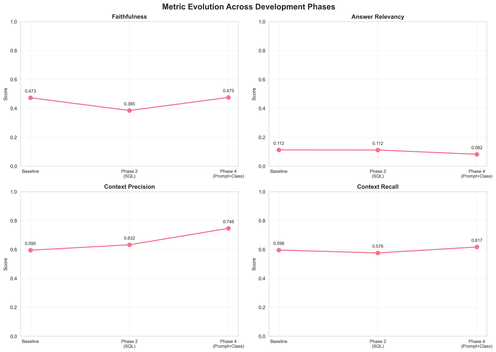
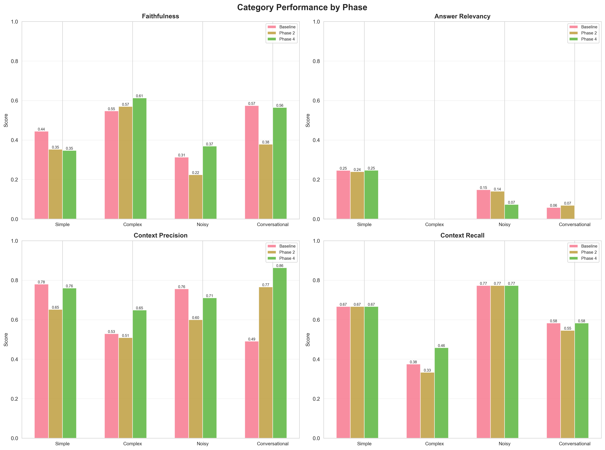
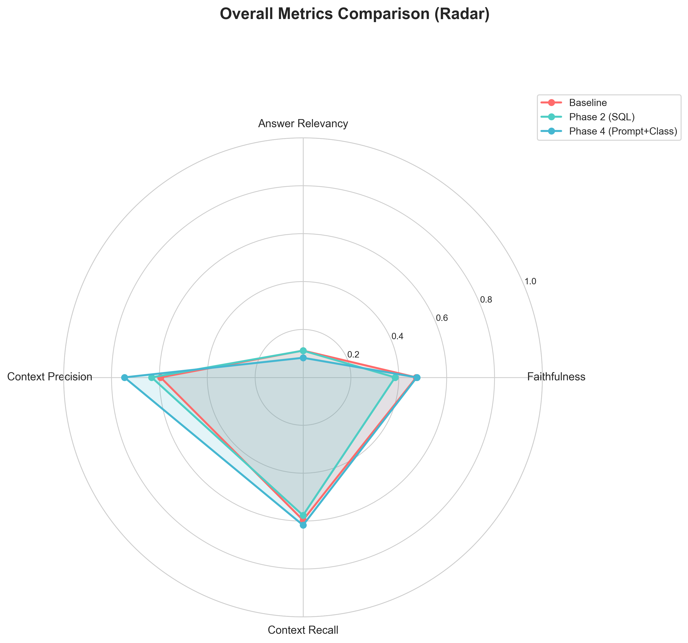
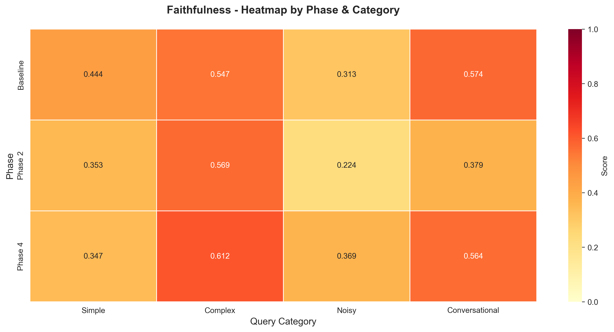
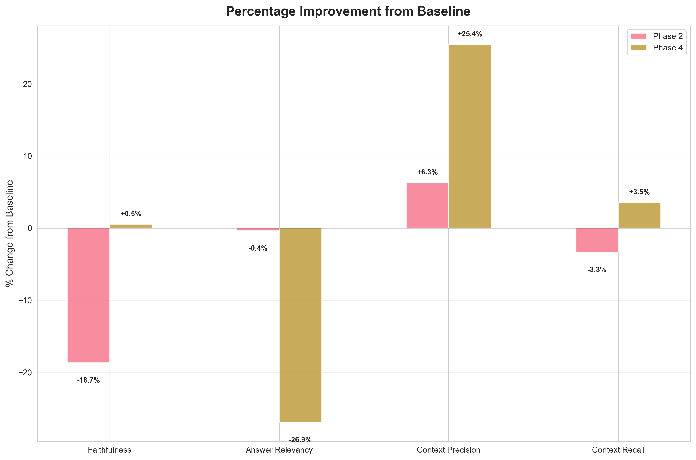

# Phase Comparison Visualization Report

**Generated:** 2026-02-07 10:57:00

## Executive Summary

This report presents a comprehensive visual comparison of RAGAS evaluation metrics 
across all development phases of the NBA RAG chatbot system.

## Available Phases

| Phase | Description | Status | Sample Count |
|-------|-------------|--------|--------------|
| Baseline | Vector search only (FAISS) | ✓ Complete | 47 |
| Phase 2 | SQL integration | ✓ Complete | 47 |
| Phase 4 | Prompt engineering + classification | ✓ Complete | 47 |
| Phase 5 | Extended test cases | ⏳ Pending | N/A |

## Overall Scores Comparison

| Metric | Baseline | Phase 2 | Phase 4 | Phase 5 |
|--------|----------|---------|---------|---------|
| Faithfulness | 0.473 | 0.385 | 0.475 | N/A |
| Answer Relevancy | 0.112 | 0.112 | 0.082 | N/A |
| Context Precision | 0.595 | 0.632 | 0.746 | N/A |
| Context Recall | 0.596 | 0.576 | 0.617 | N/A |

## Visualizations

### Metric Evolution Across Phases

Line chart showing how each metric evolves from baseline through all phases.

### Category Performance by Phase

Grouped bar chart comparing performance across query categories (simple, complex, noisy, conversational).

### Overall Metrics Radar Comparison

Radar chart providing a holistic view of all metrics across phases.

### Faithfulness Heatmap

Heatmap showing faithfulness scores by phase and category.

### Percentage Improvement

Bar chart showing percentage changes relative to baseline.

## Key Findings

### Phase 4 Improvements (vs Baseline)

- **Faithfulness**: 0.473 → 0.475 (↑ +0.5%)
- **Answer Relevancy**: 0.112 → 0.082 (↓ -26.9%)
- **Context Precision**: 0.595 → 0.746 (↑ +25.4%)
- **Context Recall**: 0.596 → 0.617 (↑ +3.5%)

## Recommendations

### High Priority

1. **Address Answer Relevancy**: Remains critically low across all phases
2. **Improve Faithfulness**: Current scores indicate significant hallucination risk
3. **Optimize Complex Query Handling**: Consistently lowest performing category

### Future Work

1. Implement ML-based query classification
2. Add SQL fallback mechanisms
3. Expand test case coverage for edge cases
4. Integrate user feedback into evaluation metrics

---

*Generated by `scripts/visualize_phases.py`*
